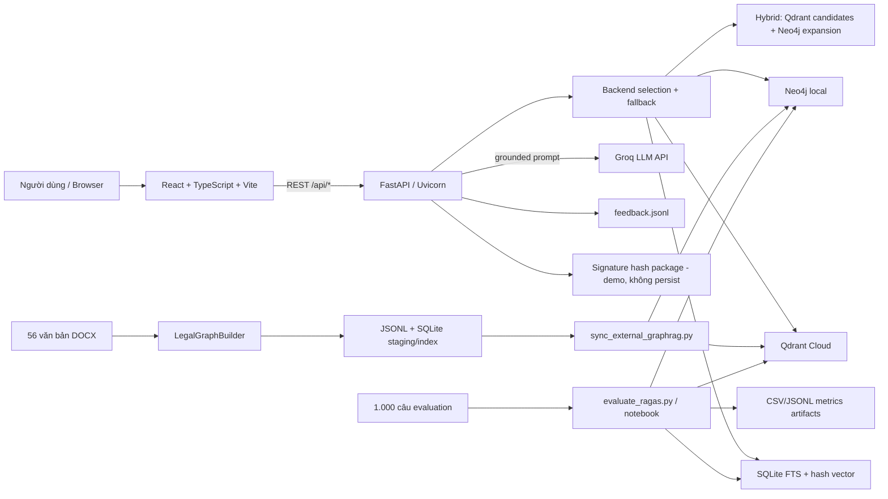

# BÁO CÁO ĐÁNH GIÁ D2, D3, P5, P6, P7 VÀ CÁC TIÊU CHÍ AI

**Dự án:** VLegalAI / LaborCare GraphRAG  
**Ngày đánh giá:** 13/07/2026  
**Phạm vi chính:** `F:\VlegalAI`  
**Nguồn sơ đồ bổ sung:** `F:\VlegalAI_Diagram` (nằm ngoài thư mục dự án, chỉ được xem là bằng chứng bổ sung)  
**Hình thức:** Audit mã nguồn, tài liệu, dữ liệu, database, artifact thực nghiệm, runtime UI/API và metadata Git tại máy bàn giao.

> Đây là báo cáo readiness nội bộ theo đúng checklist được cung cấp, không phải điểm chính thức của hội đồng. Báo cáo chấm theo bằng chứng hiện diện trong bản bàn giao; thiếu bằng chứng được ghi là “Chưa đạt/không thể chứng minh”, không đồng nghĩa nhóm chắc chắn không từng thực hiện công việc đó.

## 1. Kết luận điều hành

Dự án có **prototype GraphRAG chạy thật**, gồm React/TypeScript, FastAPI, SQLite, Neo4j, Qdrant và Groq; có pipeline parse văn bản pháp luật, graph nhiều lớp, retrieval, giao diện web và bộ đánh giá 1.000 câu. Tuy nhiên mức sẵn sàng hiện tại vẫn là **prototype**, chưa phải hồ sơ thiết kế/AI engineering hoàn chỉnh để đáp ứng toàn bộ rubric.

| Phạm vi | Đạt | Một phần | Chưa đạt | Không áp dụng | Tổng |
|---|---:|---:|---:|---:|---:|
| Toàn bộ tiêu chí | 6 | 21 | 8 | 3 | 38 |
| Chỉ tiêu chí Mandatory | 5 | 9 | 5 | 0 | 19 |

Như vậy chỉ **5/19 tiêu chí bắt buộc có bằng chứng đầy đủ**; 14 tiêu chí bắt buộc còn thiếu bằng chứng hoặc chưa đáp ứng trọn vẹn. Các blocker quan trọng nhất là:

1. **Critical Security:** `.env` chứa credential thật và `env.json` chứa Google service-account private key; dự án không có `.gitignore`. Phải revoke/rotate toàn bộ khóa ngay.
2. **Git/Team evidence:** `F:\VlegalAI` không có `.git`; Git root hiện là `F:\`, nhánh chưa có commit, không có remote và không track file dự án. Hai tiêu chí đóng góp AI bắt buộc không thể chứng minh.
3. **AI training:** không có model nào được train end-to-end trên dữ liệu dự án, không có training pipeline/seed/checkpoint; đây là hai tiêu chí AI bắt buộc chưa đạt.
4. **Thiết kế bắt buộc:** thiếu deployment, package/component, ERD chính thức, class diagram và state diagram; tài liệu flow bên ngoài repo còn lệch với code thực tế.
5. **Chất lượng GraphRAG:** trên bộ 1.000 mẫu, GraphRAG/Neo4j thua baseline RAG/Qdrant rõ rệt; chưa có RAGAS answer-quality đầy đủ và chưa có báo cáo phân tích lỗi.
6. **Production readiness:** API chưa có auth/rate limit, CORS mở toàn bộ, chưa có PII redaction/consent trước khi gửi hợp đồng sang LLM, không có test suite/CI và dependency lock đầy đủ.

## 2. Quy ước đánh giá

| Trạng thái | Ý nghĩa |
|---|---|
| **Đạt** | Có bằng chứng hiện hữu, nhất quán và đủ để trả lời tiêu chí. |
| **Một phần** | Có triển khai/bằng chứng đáng kể nhưng thiếu view, tài liệu, kiểm chứng hoặc còn sai lệch/rủi ro. |
| **Chưa đạt** | Không tìm thấy bằng chứng, hoặc bằng chứng hiện tại mâu thuẫn trực tiếp với tiêu chí. |
| **Không áp dụng** | Ngoài phạm vi kiến trúc hiện tại; cần có giải trình với hội đồng nếu rubric yêu cầu chấm literal. |

Các kiểm tra chính đã thực hiện:

- Đọc toàn bộ source chính, README, tài liệu GraphRAG, file Draw.io/Markdown liên quan và schema database.
- Parse cú pháp 8/8 file Python: pass; chạy `tsc --noEmit`: pass.
- SQLite `PRAGMA integrity_check`: `ok`; kiểm tra orphan: không phát hiện, dù schema không khai báo foreign key.
- Audit corpus 56 DOCX, index 57 document (gồm record hệ thống), 23.633 node, 51.094 edge và 25.554 chunk.
- Audit toàn bộ 1.000 mẫu evaluation và các artifact RAG/GraphRAG mới nhất.
- Chạy retrieval smoke test và kiểm tra UI desktop/mobile bằng trình duyệt thật; `/api/chat` trả HTTP 200 trên input thật, console không có error/warning.
- Kiểm tra Git root, commit, remote và tracked files.
- Đối chiếu độ mới công nghệ với tài liệu phát hành chính thức tại ngày đánh giá.

## 3. Kiến trúc “as-is” suy luận từ code

Sơ đồ sau do người đánh giá dựng lại từ code để hỗ trợ đọc báo cáo; **không được tính là sơ đồ thiết kế đã tồn tại của nhóm**.

## 4. D2 — Architecture Design

| ID | Tiêu chí | Bắt buộc | Trạng thái | Bằng chứng và khoảng trống |
|---|---|:---:|---|---|
| D2.1 | Kiến trúc được mô tả bằng deployment view và process view | Có | **Một phần** | Có data/process flow ở `F:\VlegalAI_Diagram\VlegalAi_LaborCare_Architecture.md:9-75`, user/inference flow ở `:79-171`, cùng hai file Draw.io. README mô tả Uvicorn (`README.md:26-35`), Neo4j local (`:39-55`), Qdrant Cloud (`:57-98`) và ngrok (`:115-126`). Thiếu deployment diagram thể hiện browser, FastAPI, Groq, Qdrant, Neo4j, SQLite, node/port/protocol và trust boundary; sơ đồ lại nằm ngoài repo. |
| D2.2 | Dataflow giữa tất cả sub-system được mô tả | Có | **Một phần** | Luồng build thật: parse → relations → graph → chunks → SQLite/JSONL (`app/legal_graphrag.py:256-271`); sync Neo4j (`app/external_graphrag.py:163-248`), Qdrant (`:340-380`); query → retrieve → Groq (`app/main.py:333-340,613-638`). Diagram chưa bao phủ draft/review/compare/signature/feedback (`app/main.py:641-762`) và 7 màn hình (`frontend/src/App.tsx:52-60`). Diagram ghi PDF, BGE-M3/Cohere, RRF/cross-encoder/community/session/chart storage nhưng code hiện chỉ đọc DOCX, dùng feature hash và không có các storage/processing đó. |
| D2.3 | Phân rã top-level sạch qua package/component diagram | Không | **Một phần** | Có phân lớp khái niệm và các class builder/store (`app/legal_graphrag.py:242,1067`; `app/external_graphrag.py:402,454,712`) nhưng không có package/component diagram, dependency direction hay interface ownership. `app/main.py` dài 771 dòng và `frontend/src/App.tsx` dài 1.108 dòng, chứa nhiều trách nhiệm. |
| D2.4 | Shared data/resource giữa component và API endpoint được mô tả | Không | **Một phần** | Có Pydantic request constraint (`app/main.py:81-125`), endpoint (`:546-762`), frontend API type/mapping (`frontend/src/api.ts:25-133`; `types.ts:1-49`) và DDL/payload sync. Thiếu versioned API contract, response model, error/status/auth contract, resource ownership. `CONTRACT_TEMPLATES` bị nhân đôi ở backend (`app/main.py:67-78`) và frontend (`frontend/src/data.ts:10-21`). |

### Kết luận D2

Hệ thống có luồng kỹ thuật đủ để suy luận kiến trúc, nhưng bộ hồ sơ thiết kế chưa đạt yêu cầu view-based. Cần đưa sơ đồ vào `docs/architecture/`, tách rõ **as-is** và **future/to-be**, đồng thời sinh C4 context/container, deployment và sequence/activity diagram đúng với code hiện tại.

## 5. D3 — Detail Design

| ID | Tiêu chí | Bắt buộc | Trạng thái | Bằng chứng và khoảng trống |
|---|---|:---:|---|---|
| D3.1 | Logical Design/ERD thể hiện đầy đủ entity và relationship | Có | **Một phần** | `GraphRAG_Documentation.md:39-134` mô tả entity/relationship của 8 lớp và `Graph.txt:1-87` có bản tóm tắt. Không có ERD với cardinality, optionality và thuộc tính. Domain entity được multiplex vào `nodes/edges`; thiếu model cho User, ChatSession, Message, ContractDraft, Review, SignaturePackage, Feedback và AuditLog. |
| D3.2 | Physical Database Design materialize logical design | Có | **Một phần** | SQLite tables/FTS/index ở `app/legal_graphrag.py:958-1048`; Neo4j constraint/index/fulltext ở `app/external_graphrag.py:148-160`; Qdrant collection/vector/payload index ở `:251-278`. Database thật có dữ liệu và integrity `ok`. Tuy nhiên 4 bảng nghiệp vụ không có FK, hầu như không có `NOT NULL`, default, `CHECK`, length/domain constraint; không có migration/version, data dictionary hoặc mapping logical→SQLite/Neo4j/Qdrant. |
| D3.3 | Screen design nhất quán, thẩm mỹ và dễ dùng | Không | **Một phần** | 7 route và flow chính rõ (`frontend/src/App.tsx:52-60,388-829`); có validation cơ bản, dark/light theme, responsive CSS (`frontend/src/styles.css:1-46,1361-1498`). Kiểm tra thực tế xác nhận desktop/mobile render tốt và console sạch. Tuy nhiên chưa có screen inventory/spec/flow; nút Lịch sử không tạo thay đổi (`App.tsx:538`), Google login chưa có handler (`:1081-1084`), ký văn bản được ghi là demo (`:823`), và composer cố định che một phần thẻ gợi ý cuối ở viewport 390×844. |
| D3.4 | Class design có static/data/control/state view và intent từng unit | Không | **Một phần** | Có config dataclass, builder, store classes và React functional components. Không có class/sequence/control-flow diagram, invariant hoặc interface chung; `get_store` trả `Any` (`app/main.py:181-204`), logic graph expansion bị lặp giữa Neo4j và hybrid. |
| D3.5 | Main entity model đủ state/behavior và có state diagram | Có | **Chưa đạt** | Tài liệu chỉ nêu ontology `TrạngTháiPhápLý`/`CHUYỂN_TRẠNG_THÁI` (`GraphRAG_Documentation.md:80-88`). Lifecycle trong code là chuỗi node/cạnh hard-coded (`app/legal_graphrag.py:567-599`), không phải state machine. Signature luôn trả `status="ready"`, không persist (`app/main.py:727-751`); contract chỉ có UI state `start/create/edit` (`frontend/src/App.tsx:503`). Không có state diagram cho legal effectivity, ingestion job, chat, contract hoặc signature. |

### Bằng chứng UI runtime

- Desktop home: `output/playwright/desktop-home.png`
- Desktop response từ input thật: `output/playwright/desktop-chat-result.png`
- Mobile 390×844: `output/playwright/mobile-home.png`
- Mobile menu: `output/playwright/mobile-menu.png`

## 6. P5 — Technology Choices for Software Architecture

| ID | Tiêu chí | Bắt buộc | Trạng thái | Bằng chứng và khoảng trống |
|---|---|:---:|---|---|
| P5.1 | Sử dụng external/third-party services hợp lý | Có | **Một phần** | Phân vai Groq sinh câu trả lời (`app/main.py:300-330`), Neo4j graph, Qdrant vector và SQLite fallback là hợp lý. Tuy nhiên API chưa auth/rate limit; CORS `*` (`app/main.py:42-48`); nội dung hợp đồng có thể gửi sang Groq (`:672-684`) mà chưa có PII redaction/consent/DPA; Groq call thiếu timeout/retry/circuit breaker rõ ràng. |
| P5.2 | Frontend hiện đại và có design pattern tốt | Không | **Một phần** | React, TypeScript, Vite; TypeScript strict; API abstraction; responsive; `tsc --noEmit` pass. Vite 8.1 là dòng hiện hành, nhưng runtime React 18.3.1 trong khi tài liệu chính thức hiện liệt kê React 19.2 là latest; TypeScript cài 5.9.3 trong khi TypeScript 7.0 đã phát hành. `@types/react` 19.2.x lệch runtime React 18; thiếu ESLint/Prettier/test và `App.tsx` monolithic. Tham chiếu: [React versions](https://react.dev/versions), [Vite releases](https://vite.dev/blog), [TypeScript 7.0](https://devblogs.microsoft.com/typescript/announcing-typescript-7-0/). |
| P5.3 | Backend hiện đại và thiết kế tốt | Không | **Một phần** | FastAPI REST/Pydantic, các store SQLite/Qdrant/Neo4j/hybrid là stack hiện đại. Môi trường đang có FastAPI 0.136.3, gần với 0.137.1 tại ngày audit ([release notes](https://fastapi.tiangolo.com/release-notes/)). Tuy nhiên route sync gọi network/DB, dùng global mutable cache, thiếu DI/lifespan cleanup/response model; nhiều broad exception và dependency Python phần lớn không pin. |
| P5.4 | Mobile technology hiện đại | Không | **Không áp dụng** | Không có Flutter, Swift/iOS, Android, React Native hoặc Capacitor. Chỉ có responsive web; nếu rubric yêu cầu sản phẩm mobile riêng thì tiêu chí này phải đổi thành Chưa đạt. |

## 7. P6 — Application of Computing Knowledge for Implementation

| ID | Tiêu chí | Bắt buộc | Trạng thái | Bằng chứng và khoảng trống |
|---|---|:---:|---|---|
| P6.1 | Source code theo coding convention | Có | **Một phần** | Python dùng snake_case/type hints; TypeScript strict; 8/8 Python file parse và frontend type-check pass. Không có test, lint/formatter/backend type-check hoặc CI. File quá lớn, nhiều `except Exception`; CLI query lỗi encoding trên Windows mặc định nếu không bật UTF-8 (`scripts/query_graphrag.py:23-25`). |
| P6.2 | Áp dụng OOP/SOLID | Không | **Một phần** | Có frozen config dataclass, Builder và store encapsulation (`app/external_graphrag.py:67-105,402,454,712`; `app/legal_graphrag.py:242-277`). Chưa có `Protocol`/ABC retriever, dùng `Any`, lặp graph expansion (`external_graphrag.py:604-673,854-923`) và `main.py` trộn HTTP/prompt/business/persistence. |
| P6.3 | Dùng config/access token/enumeration phù hợp | Không | **Chưa đạt — Critical** | `.env.example` và cơ chế đọc env là đúng, nhưng `.env` đang chứa credential thật; `env.json:2-6` chứa Google service-account/private key; không có `.gitignore`. Backend mode vẫn là raw string/alias dictionary (`app/main.py:128-155`), đường dẫn trong `.env.example` hard-code `F:\VlegalAI`. Phải revoke/rotate và đưa secret ra secret manager trước mọi commit/deploy. |
| P6.4 | Áp dụng design pattern | Không | **Một phần** | Có Builder, Strategy/Factory-like store selection và fallback chain (`app/legal_graphrag.py:256-271`; `app/main.py:162-204`). Pattern còn ngầm định, thiếu interface/DI và có duplication. |
| P6.5 | Database theo standard | Không | **Một phần** | Tên table/column snake_case, PK/index rõ; Neo4j có unique constraints. Database integrity `ok`, không orphan. Tuy nhiên SQLite không có FK, hầu như thiếu NOT NULL/CHECK/default, không migration/schema version; build xóa rồi tạo lại DB (`app/legal_graphrag.py:958-960`). |

## 8. P7 — Complexity of Algorithm / Internal Processing

| ID | Tiêu chí | Bắt buộc | Trạng thái | Bằng chứng và khoảng trống |
|---|---|:---:|---|---|
| P7.1 | Nêu đúng bài toán cần giải quyết | Có | **Đạt** | README xác định chatbot pháp luật lao động, cấu trúc văn bản, graph/vector/LLM (`README.md:1-10`); tài liệu nêu mục tiêu GraphRAG nhiều lớp (`GraphRAG_Documentation.md:7-11`). Nên bổ sung stakeholder, acceptance criteria định lượng, phạm vi corpus/effectivity và giới hạn tư vấn pháp lý. |
| P7.2 | Chọn đúng thuật toán | Có | **Một phần — rủi ro cao** | Tổng thể parse/chunk/index + FTS/vector/graph expansion là hướng hợp lý. Nhưng “dense vector” thực tế là feature hashing word/character grams (`app/legal_graphrag.py:154-208`) và Qdrant dùng lại vector này (`app/external_graphrag.py:336-337`), không phải semantic embedding. Local vector search quét tuần tự 25.554 vector (`legal_graphrag.py:1223-1229`). Graph sinh sai quan hệ: code có thể gắn `BỊ_NẰM_TRONG_DANH_MỤC_CẤM` cho hợp đồng/quyền lợi (`:697-729`); audit DB thấy 671 cạnh quyền lợi→bị cấm và 206 cạnh hợp đồng→bị cấm. Từ khóa `sa thái` sai chính tả tại `:619,705,829,867`. |
| P7.3 | Dùng đúng library/source/service | Không | **Một phần** | FastAPI, Pydantic, Neo4j/Qdrant/Groq SDK và RAGAS là lựa chọn đúng. Chưa có semantic embedding/reranker benchmark cho tiếng Việt pháp lý; nhiều dependency không pin; Qdrant mới đang index feature hash nên chưa khai thác đúng vector database. |
| P7.4 | Implement/enhance giải pháp sẵn có để cho kết quả tốt hơn | Không | **Một phần** | Có custom engineering đáng kể: graph 8 lớp, reference extraction, lifecycle/risk/precedent rules, weighted propagation và fallback. Tuy nhiên chưa chứng minh “tốt hơn”: GraphRAG hiện thua RAG baseline và không có ablation cho layer, expansion, fusion hay hybrid. |

Smoke test local với câu “Người lao động có quyền đơn phương chấm dứt hợp đồng khi nào?” xếp Điều 36 — quyền của **người sử dụng lao động** — hạng 1; Điều 35 đúng đối tượng chỉ ở hạng 5. Luồng UI top-k=10 + Groq vẫn tổng hợp được câu trả lời phù hợp, nhưng lỗi ranking này là rủi ro đáng kể cho hệ thống pháp lý.

## 9. AI-Specific Criteria

### 9.1 Data Processing Pipeline

| ID | Tiêu chí | Bắt buộc | Trạng thái | Bằng chứng và khoảng trống |
|---|---|:---:|---|---|
| AI-DP.1 | Dataset clean, preprocess và split train/val/test | Có | **Một phần** | Có đọc/normalize DOCX (`app/legal_graphrag.py:225-239`), build graph/index (`:256-271`) và chunk theo hierarchy/sliding window (`:921-955`). Không có train/val/test split; evaluator chỉ dùng offset/limit (`scripts/evaluate_ragas.py:68-73`), dataset 1.000 mẫu không có trường split. |
| AI-DP.2 | Augmentation/oversampling khi phù hợp | Không | **Không áp dụng** | Không có supervised training/class imbalance workflow. Nếu nhóm bổ sung fine-tuning thì phải xem xét augmentation/balancing trên train set, không được áp dụng vào test set. |
| AI-DP.3 | Label/annotation đầy đủ và được verify | Không | **Một phần** | 1.000 ID/câu hỏi duy nhất; không thiếu question/reference/context/chunk ID; 1.280 context đều tồn tại trong index. Nhưng nhãn tự sinh (700 `chunk`, 300 `chunk+graph`), không có generator script, guideline, reviewer log hoặc inter-annotator agreement. Có citation parse lỗi và bias lớn: 541/1.280 context từ `26_2008_QH12_82197.docx`, 483/1.280 từ `22_VBHN-BTC_445967.docx` — hai tài liệu chiếm đúng 80%. |

### 9.2 AI Model Implementation

| ID | Tiêu chí | Bắt buộc | Trạng thái | Bằng chứng và khoảng trống |
|---|---|:---:|---|---|
| AI-MI.1 | Có ít nhất một model train end-to-end trên dataset dự án | Có | **Chưa đạt** | Không có optimizer/loss/backward/epoch/Trainer, checkpoint hoặc model artifact. Notebook chỉ tải pretrained DeepSeek và gọi `model.eval()`; production gọi model Groq (`app/main.py:300-315`). Xây index/RAG không phải model training. |
| AI-MI.2 | Training pipeline reproducible: config, seed, script | Có | **Chưa đạt** | Không có training pipeline hay seed; Python không có lockfile đầy đủ; notebook cài dependency unpinned. Cả 9 notebook cell đều chưa execute/không output. Notebook sửa 13/07/2026 nhưng artifact đầy đủ mới nhất là 02/07/2026, nên không truy vết được artifact về code hiện tại. |
| AI-MI.3 | Fine-tuning/transfer learning khi phù hợp | Không | **Không áp dụng có điều kiện** | Hệ thống dùng pretrained model/API ở inference, không có LoRA/PEFT/fine-tuning. Có thể giải trình N/A cho kiến trúc RAG/API; nếu hội đồng chấm literal hoặc yêu cầu model training, tiêu chí phải đổi thành Chưa đạt. |
| AI-MI.4 | Inference tích hợp prototype/demo | Có | **Đạt** | `/api/chat` retrieve và gọi LLM (`app/main.py:613-638`), context/prompt grounding tại `:263-330`, `/api/search` tại `:603-610`. Runtime audit trên input thật trả `/api/chat` 200 và UI hiển thị câu trả lời có 10 nguồn. |

### 9.3 Experimental Results & Evaluation

| ID | Tiêu chí | Bắt buộc | Trạng thái | Bằng chứng và khoảng trống |
|---|---|:---:|---|---|
| AI-ER.1 | Có initial evaluation metrics | Có | **Đạt cho retrieval** | Artifact 1.000 mẫu có hit@10, precision, recall, MRR và latency tại `storage/eval/ragas_notebook/20260702-082502/comparison_exact.csv`. Code hỗ trợ RAGAS, nhưng chưa có RAGAS answer-quality đầy đủ; file RAGAS duy nhất chỉ 1 mẫu và metric trống. |
| AI-ER.2 | So sánh baseline model/method | Có | **Đạt** | RAG/Qdrant và GraphRAG/Neo4j được chạy trên cùng 1.000 mẫu, top-k=10. RAG là baseline hợp lý, dù chưa có BM25-only/semantic-embedding/hybrid/ablation. |
| AI-ER.3 | Đánh giá trên held-out test, không dùng training data | Có | **Một phần** | Evaluation file tách khỏi corpus build và không có model training. Tuy nhiên không có split manifest, dataset hash/version freeze hoặc bằng chứng 1.000 câu chưa được dùng để tune nhiều vòng; chưa thể xác nhận held-out độc lập. |
| AI-ER.4 | Phân tích error case/failure mode | Không | **Chưa đạt** | Notebook chỉ có cell in miss đầu tiên, chưa được execute và không có kết luận. Không có report phân nhóm lỗi; `graphrag_prepare_errors.jsonl` là lỗi kết nối, không phải model failure analysis. Phân tích ở mục 10 của báo cáo này là kết quả audit mới, không được tính là artifact sẵn có của nhóm. |

### 9.4 AI Engineering Quality

| ID | Tiêu chí | Bắt buộc | Trạng thái | Bằng chứng và khoảng trống |
|---|---|:---:|---|---|
| AI-AQ.1 | Không fake/hard-coded; AI chạy input thật | Có | **Đạt có điều kiện** | Chat thực sự retrieve + gọi Groq, runtime trace trả input thật. Khi thiếu API key hoặc call lỗi, hệ thống dùng fallback rule-based (`app/main.py:287-297,625-630`), nên buổi demo phải hiển thị `groq_ready=true`, backend thực và trace/citation để tránh bị hiểu là fallback. Signature vẫn là demo nhưng không phải AI chat criterion. |
| AI-AQ.2 | Custom engineering ngoài plain API call | Không | **Đạt** | Có legal parsing, graph ontology, multi-level chunking, feature hash/FTS, graph expansion, Qdrant/Neo4j/hybrid, grounded prompt và source citation (`app/legal_graphrag.py:242-271,921-955,1099-1348`; `app/external_graphrag.py:402-961`; `app/main.py:318-330`). |
| AI-AQ.3 | Model versioning/experiment tracking | Không | **Chưa đạt** | Không có MLflow/W&B/DVC/model registry. Folder timestamp không lưu Git SHA, dataset hash, model revision, prompt hash, dependency snapshot, seed hoặc full config; không thể nối response/artifact với code/model cụ thể. |

### 9.5 Team AI Contribution Evidence

| ID | Tiêu chí | Bắt buộc | Trạng thái | Bằng chứng và khoảng trống |
|---|---|:---:|---|---|
| AI-TC.1 | GitHub history có AI/ML commit từ nhiều thành viên | Có | **Chưa đạt / không thể chứng minh** | `F:\VlegalAI\.git` không tồn tại. Git top-level là `F:\`, có 0 commit, 0 remote và 0 file VlegalAI được track. Cần bàn giao đúng clone có lịch sử thật; không được tạo commit giả để đối phó rubric. |
| AI-TC.2 | Đóng góp AI từng thành viên được tài liệu hóa | Có | **Chưa đạt** | Không có AUTHORS/CONTRIBUTORS/CONTRIBUTING hay `AI_CONTRIBUTIONS.md`; README không ánh xạ thành viên tới dataset, retrieval, model hoặc evaluation. |

## 10. Phân tích kết quả AI hiện có

### 10.1 Kết quả tổng thể trên 1.000 mẫu

Nguồn: `storage/eval/ragas_notebook/20260702-082502/comparison_exact.csv`.

| Backend | N | Top-k | Exact hit rate | Exact precision | Exact recall | Exact MRR | Avg latency (s) |
|---|---:|---:|---:|---:|---:|---:|---:|
| RAG / Qdrant | 1.000 | 10 | 0,5700 | 0,0643 | 0,5150 | 0,4043 | 7,3033 |
| GraphRAG / Neo4j | 1.000 | 10 | 0,2460 | 0,0256 | 0,2325 | 0,1723 | 5,5081 |

GraphRAG giảm **32,4 điểm phần trăm hit rate**, **28,25 điểm phần trăm recall** và khoảng **57,4% MRR tương đối** so với RAG. GraphRAG nhanh hơn khoảng 24,6% trong artifact này, nhưng chất lượng retrieval thấp hơn rõ rệt. Chưa có benchmark `hybrid_rag`, dù đây là mode mặc định trên UI.

### 10.2 Failure modes theo loại câu hỏi

| Loại câu hỏi | Số mẫu | RAG hit@10 | GraphRAG hit@10 | Nhận định |
|---|---:|---:|---:|---|
| graph_entity | 150 | 27,33% | 37,33% | Nhóm duy nhất GraphRAG tốt hơn RAG. |
| graph_relation | 150 | 38,67% | 30,00% | Graph relation chưa tạo lợi thế. |
| multi_hop | 200 | 58,00% | 12,00% | Lỗi nghiêm trọng ở bài toán vốn là mục tiêu của GraphRAG. |
| comparison | 80 | 83,75% | 16,25% | GraphRAG mất nhiều context cần so sánh. |
| temporal_validity | 60 | 60,00% | 0,00% | Không xử lý được hiệu lực/thời gian trên test hiện tại. |
| insufficient_context | 20 | 45,00% | 0,00% | Chưa chứng minh khả năng nhận biết thiếu căn cứ. |

Các nguyên nhân khả dĩ cần kiểm chứng bằng ablation/error analysis:

- Graph schema sinh cạnh sai ngữ nghĩa và có typo trong từ khóa, làm expansion nhiễu.
- Neo4j path dùng full-text + graph weights nhưng không có semantic vector candidate như RAG.
- Feature hash không phải embedding ngữ nghĩa tiếng Việt pháp lý.
- Relation weights là hằng số thủ công, bị lặp giữa store và chưa được tune trên validation set.
- Dataset bị tập trung 80% context ở hai tài liệu, có thể làm metric không đại diện cho toàn corpus.
- Không có reranker/cross-encoder, citation/effectivity filter hoặc explicit insufficient-context threshold.

## 11. Phát hiện bảo mật và quyền riêng tư

### P0 — Phải xử lý ngay

1. Thu hồi và tạo lại Google service-account key trong `env.json`.
2. Rotate Groq API key, Qdrant API key, Neo4j password và ngrok token trong `.env`.
3. Xóa secret khỏi working tree và lịch sử Git thật sau khi repository được khôi phục; dùng history-rewrite nếu khóa từng được commit.
4. Thêm `.gitignore` tối thiểu cho `.env`, `env.json`, credential JSON, `venv/`, `node_modules/`, `storage/logs/`, SQLite WAL/SHM và artifact nhạy cảm.
5. Dùng secret manager/CI secret; chỉ giữ `.env.example` với placeholder và đường dẫn tương đối.

Trong quá trình audit, private key đã xuất hiện trong đầu ra công cụ nội bộ. Không lặp lại giá trị trong báo cáo này; phải coi khóa đã compromised ngay cả khi chưa xác định nó từng được commit hay chưa.

### P1 — Trước khi demo/deploy công khai

- Bổ sung authentication/authorization, rate limiting, request size limit và CORS allowlist.
- Thêm timeout, retry có backoff, circuit breaker và quota/cost monitoring cho Groq/Qdrant/Neo4j.
- Có consent, privacy notice, retention policy và PII redaction trước khi gửi hợp đồng/hồ sơ sang LLM bên thứ ba.
- Không trả raw backend exception/connection detail cho client; thêm structured logging và secret redaction.

## 12. Lộ trình khắc phục ưu tiên

| Ưu tiên | Hành động | Tiêu chí tác động | Deliverable/điều kiện hoàn tất |
|---|---|---|---|
| P0 | Rotate/revoke secret, xóa credential khỏi cây dự án, thêm ignore/secret manager | P6.3, P5.1 | Secret scan sạch; tất cả khóa cũ bị thu hồi; app chạy bằng secret injection mới. |
| P0 | Khôi phục đúng GitHub clone có lịch sử thật | AI-TC.1, AI-TC.2 | `.git` nằm trong `F:\VlegalAI`; remote đúng; lịch sử AI của nhiều thành viên; `AI_CONTRIBUTIONS.md` ánh xạ commit/PR/deliverable. |
| P0 | Sửa graph extraction/relations/typo và rebuild toàn bộ index | P7.2, P7.4, AI-ER.4 | Unit test cho relation; không còn benefit/contract→prohibited sai; smoke query xếp đúng chủ thể; artifact index version mới. |
| P1 | Hoàn thiện bộ tài liệu kiến trúc as-is | D2.1-D2.4 | C4 context/container, deployment, dataflow/sequence, component/package và API contract được version trong repo. |
| P1 | Hoàn thiện detail design | D3.1-D3.5 | ERD/cardinality, graph logical schema, physical data dictionary/mapping, class diagram, screen spec/flow và state diagram cho document/index/chat/contract/signature. |
| P1 | Chốt protocol dataset | AI-DP.1, AI-DP.3, AI-ER.3 | Generator script, provenance/license, checksum, train/dev/test hoặc dev/test manifest, test freeze, annotation guideline và reviewer log; sửa citation parser và giảm document bias. |
| P1 | Đáp ứng model-training requirement hoặc xin ngoại lệ chính thức | AI-MI.1-AI-MI.3 | Nếu bắt buộc: fine-tune embedding/reranker/model nhỏ trên train, tune dev, test đúng một lần; có config/seed/checkpoint. Nếu không: văn bản giải trình được hội đồng chấp thuận cho RAG/API. |
| P1 | Chạy evaluation đầy đủ | AI-ER.1-AI-ER.4 | Benchmark BM25, RAG, GraphRAG, hybrid, reranker/ablation; RAGAS context precision/recall, faithfulness, relevancy, correctness; error analysis theo taxonomy. |
| P1 | Experiment tracking | AI-AQ.3 | MLflow/W&B hoặc tối thiểu `run_manifest.json` có Git SHA, dataset/index hash, model/revision, prompt hash, config, seed, package versions, thời gian và metric. |
| P2 | Refactor và engineering hardening | P5.2-P6.5 | Retriever Protocol/DI, tách router/service/repository, async I/O phù hợp, dependency lock, lint/type-check/test/CI, DB constraints/migrations. |
| P2 | Hoàn thiện UX | D3.3 | Sửa mobile overlap, history/login/sign flow, keyboard/focus/error state; screen-level accessibility và responsive regression tests. |

## 13. Gói bằng chứng nên chuẩn bị cho buổi chấm

- `docs/architecture/`: system overview, C4, deployment, component/package, activity/sequence và dataflow.
- `docs/design/`: ERD, graph schema, physical data dictionary, class/state/screen diagrams và OpenAPI export.
- `docs/ai/`: dataset card, annotation guideline, split manifest, model card, evaluation report, error analysis và contribution matrix.
- `experiments/<run-id>/run_manifest.json`: config + hash + version + metric + artifact links.
- Video/demo script chứng minh một input mới đi qua retrieve → LLM → cited response; hiển thị backend/model/version và không dùng fallback.
- GitHub Insights/PR/commit links thể hiện đóng góp AI thật từ nhiều thành viên.
- Security evidence: secret scan, key-rotation record, privacy flow và external-service data handling.

## 14. Kết luận cuối

VLegalAI có phần custom engineering đáng kể và không phải một demo chỉ gọi API đơn thuần. Điểm mạnh là pipeline pháp luật, graph ontology, multi-backend retrieval, giao diện hoàn chỉnh và bộ evaluation 1.000 mẫu. Tuy nhiên hồ sơ hiện tại chưa đáp ứng đầy đủ rubric bắt buộc do thiếu design views, thiếu training/reproducibility, thiếu Git evidence và kết quả GraphRAG chưa vượt baseline.

Ưu tiên hợp lý trước buổi chấm là: **(1) xử lý secret và khôi phục Git evidence; (2) sửa graph/retrieval và chạy lại evaluation; (3) hoàn thiện diagram/ERD/state design; (4) đáp ứng hoặc xin ngoại lệ model-training requirement; (5) đóng gói toàn bộ bằng chứng thành artifact có version và hash.**

## Phụ lục A — Giới hạn của audit

- Không có URL GitHub/remote nên không thể kiểm tra lịch sử server-side, PR, branch protection hoặc contributor statistics.
- `F:\VlegalAI_Diagram` nằm ngoài repo; báo cáo dùng để đối chiếu nhưng không xem là artifact đã version cùng source.
- Không thực hiện pentest hay load test; kiểm tra runtime chỉ nhằm xác nhận luồng UI/API và retrieval/inference.
- Không xác nhận tính đúng/sự còn hiệu lực của từng văn bản pháp luật; audit tập trung vào software/AI engineering và bằng chứng rubric.
- Các tiêu chí “Không áp dụng” cần được hội đồng chấp thuận; nếu chấm literal, chúng có thể bị chuyển thành “Chưa đạt”.
