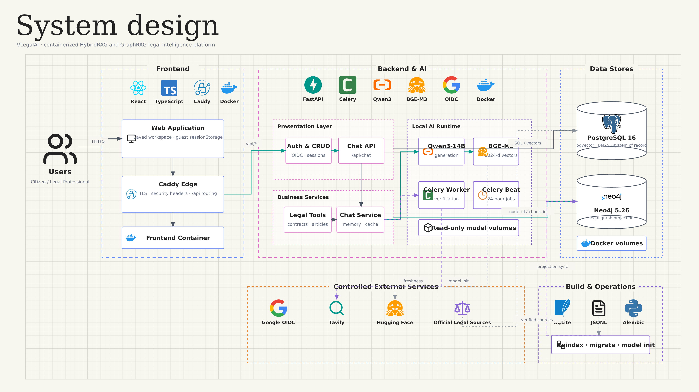
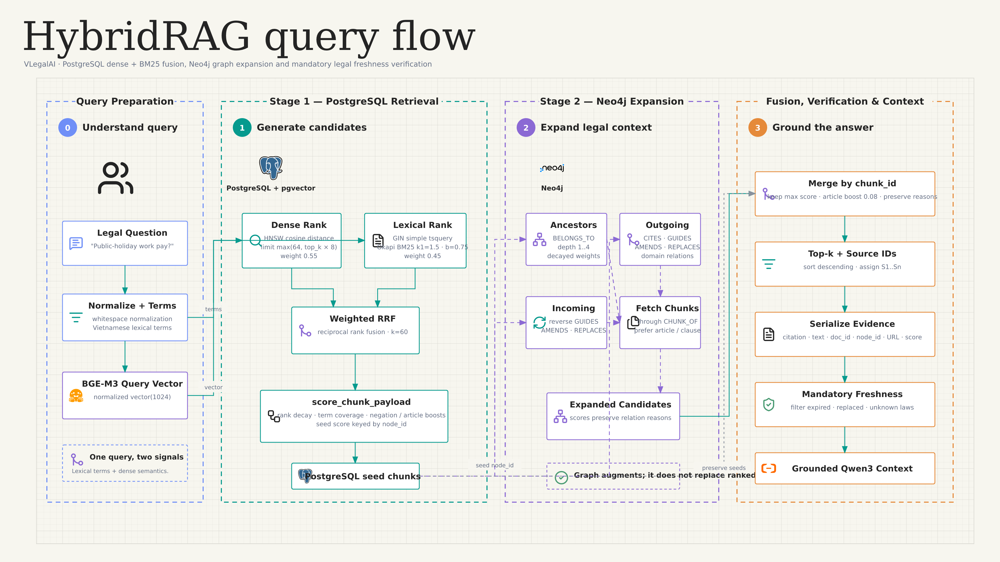
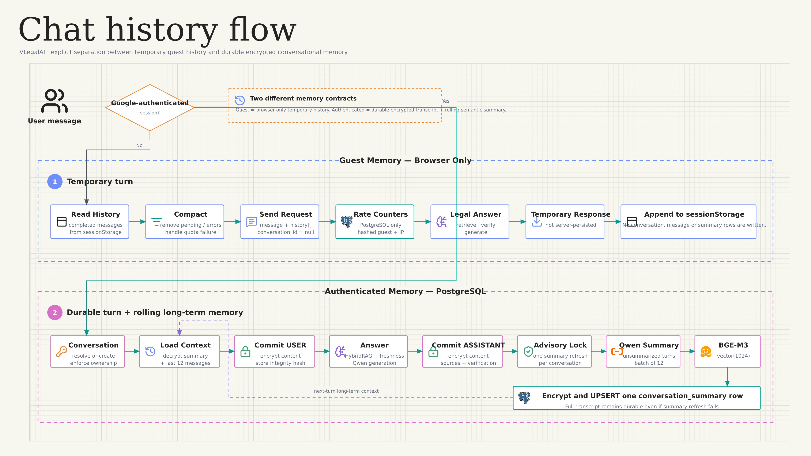
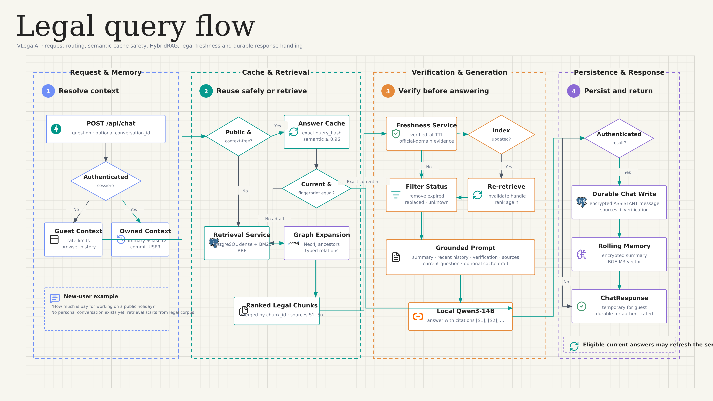
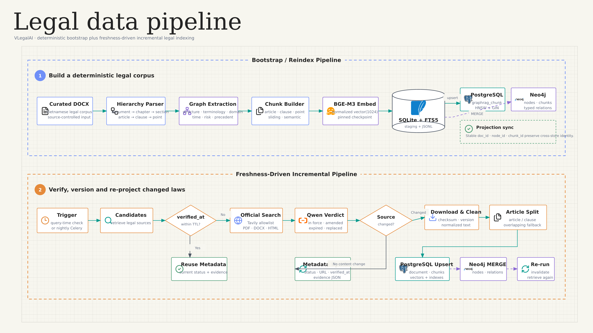

# VLegalAI Architecture Report

## Scope and source baseline

This package describes the **AS-IS implementation** of:

- Repository: `tuankiettran287/VlegalAI`
- Branch: `master`
- Commit: `18c0c25ed7a66f6f9088320522bba102ea6427d6`
- Commit time: `2026-07-23T10:43:48+07:00`
- Analysis date: `2026-07-23`

The diagrams are based on the application code, Alembic migrations, Docker Compose topology, frontend persistence logic, and retrieval/indexing implementations. They are not based solely on the repository README.

> Important: older files under `docs/design/` describe a Qdrant/DeepSeek-oriented target design. The current runtime at this commit uses PostgreSQL/pgvector, Neo4j, local Qwen3-14B, and local BGE-M3. This package represents the current source code.

## Executive summary

The architectural style is best described as a **containerized modular
monolith with asynchronous workers, polyglot persistence, and a
HybridRAG/GraphRAG retrieval pipeline**. FastAPI contains the application
modules and orchestration, while Celery runs background work; PostgreSQL is the
authoritative store and Neo4j/SQLite are rebuildable projections.

VLegalAI is a containerized Vietnamese legal platform with:

- A React + TypeScript SPA behind Caddy and a frontend proxy.
- A FastAPI service for Google authentication, legal chat, contract tools, articles, signatures, feedback, and CRUD.
- Local Qwen3-14B for answer generation, law-status classification, article synthesis, contract work, and conversation summaries.
- Local BGE-M3 for normalized 1024-dimensional legal, query, summary, and cache embeddings.
- PostgreSQL 16 + pgvector as the main system of record, vector store, lexical store, rate-limit store, advisory-lock provider, and Celery transport/result database.
- Neo4j as the legal graph projection and graph-expansion engine.
- Tavily as a controlled web-search adapter for official-domain law freshness and article research.
- SQLite + JSONL as bootstrap artifacts and the optional local GraphRAG fallback, not the default production data plane.

## Runtime retrieval modes

The backend selector is server-side only; the frontend does not let users choose a retrieval mode.

| `RETRIEVER_BACKEND` | Implementation | Data plane |
|---|---|---|
| `hybrid_rag` — default | `Neo4jPostgresGraphRAGStore` | PostgreSQL dense + BM25 retrieval, then Neo4j expansion |
| `rag` | `PostgresGraphRAGStore` | PostgreSQL dense + BM25 with weighted RRF |
| `graphrag` | `Neo4jGraphRAGStore` | Neo4j full-text seeds followed by graph expansion |
| `local_graphrag` | `GraphRAGStore` | SQLite FTS/vector fallback |

### Default HybridRAG algorithm

1. Normalize the user query.
2. Embed it locally with BGE-M3 as a normalized 1024-dimensional vector.
3. Retrieve dense candidates from `graphrag_chunk` using pgvector cosine distance and its HNSW index.
4. Retrieve lexical candidates from the same table using PostgreSQL `simple` text search, GIN filtering, and explicit Okapi BM25 scoring.
5. Fuse the independent rankings with weighted Reciprocal Rank Fusion:
   - dense weight: `0.55`
   - BM25 weight: `0.45`
   - RRF rank constant: `60`
6. Apply application scoring for rank decay, term coverage, negation, selected domain phrases, and article/clause/point preference.
7. Seed Neo4j with candidate `node_id` values.
8. Expand:
   - `BELONGS_TO` ancestors for depth 1–4;
   - supported outgoing legal/semantic/process/risk/precedent relations;
   - reverse `GUIDES`, `AMENDS`, and `REPLACES` relations.
9. Fetch chunks connected with `CHUNK_OF`, merge by `chunk_id`, keep the maximum score, add an article boost, sort, and select `top_k`.
10. Assign citations `S1..Sn`, verify law freshness, filter unsafe sources, and build the Qwen prompt.

## End-to-end legal query behavior

### Guest user

- The browser keeps completed messages in `sessionStorage`.
- The browser submits this temporary history with each chat request.
- The backend stores only distributed rate-limit counters keyed by a SHA-256 hash of guest ID and client IP.
- No `conversation`, `chat_message`, or `conversation_summary` rows are created.
- The response is marked `temporary=true`.

### Authenticated user

- Google OIDC uses Authorization Code + PKCE.
- The session is represented by a signed HttpOnly cookie.
- Existing chat context comes only from PostgreSQL:
  - decrypt the one-row rolling conversation summary;
  - decrypt the most recent 12 messages;
  - use the latest 8 messages in the prompt.
- The user message is encrypted and committed before retrieval.
- The assistant answer is encrypted and committed with its public sources and verification JSON.
- A per-conversation PostgreSQL advisory transaction lock protects summary refresh.
- Qwen creates an incremental summary; BGE-M3 embeds it; the encrypted summary and vector are upserted.

## Semantic answer cache

The shared answer cache is privacy-gated:

- It is considered only for public, context-free legal questions.
- Queries with conversation context, direct identifiers, or private-language patterns are excluded.
- Exact normalized-query matches may return the cached answer directly.
- Similar matches above the default `0.96` threshold are used only as a draft; normal retrieval and generation still run.
- Every hit is revalidated against current law status and a source/verification fingerprint.
- The default TTL is 24 hours.
- Query and answer text are encrypted; the query embedding, hashes, sources, verification, model name, prompt version, expiry, and counters remain queryable.

## Mandatory freshness loop

Freshness verification is enabled by default and occurs before a legal answer is finalized:

1. Extract up to 16 distinct law identities from retrieved sources.
2. Reuse a `legal_document.verified_at` result when it is within the default 24-hour TTL.
3. Otherwise acquire a PostgreSQL advisory transaction lock for the law code.
4. Search Tavily with an allowlist of official legal domains.
5. Ask local Qwen to classify the law as `IN_FORCE`, `PARTIALLY_IN_FORCE`, `AMENDED`, `EXPIRED`, `REPLACED`, or `UNKNOWN`.
6. Update law metadata and evidence.
7. When a new or changed official source is identified:
   - download PDF, DOCX, or HTML;
   - clean and checksum the text;
   - increment the document version if content changed;
   - split by Article and Clause, with a window fallback;
   - write `legal_document` and `legal_chunk`;
   - embed and upsert `graphrag_chunk`;
   - merge the Neo4j graph projection.
8. Retrieve again after an index update.
9. Remove expired, replaced, or unknown sources. If no safe source remains, return an error rather than an ungrounded answer.

## Legal data ingestion

### Bootstrap path

The reindex job:

1. Reads curated DOCX files.
2. Parses documents into structural nodes such as document, chapter, section, article, clause, and point.
3. Adds semantic graph nodes and typed relations across terminology, domain, temporal state, process, lifecycle, compliance/risk, and precedent concepts.
4. Builds structure, article, clause, point, sliding-window, and semantic chunks.
5. Embeds every chunk with BGE-M3.
6. Writes `legal_graphrag.sqlite` and JSONL exports.
7. Synchronizes:
   - chunks and embeddings into PostgreSQL `graphrag_chunk`;
   - nodes, chunks, and typed relationships into Neo4j.

### Incremental path

Query-time and scheduled freshness verification use `LegalIndexer` to update PostgreSQL and Neo4j directly from official online sources. This path does not require rebuilding the entire SQLite corpus.

## Persistence and protection boundaries

Application-layer AES-GCM encryption is used for:

- chat message content;
- conversation summary text;
- artifact content;
- signature document text;
- feedback message text;
- semantic-cache query and answer text.

SHA-256 hashes support equality/integrity checks for several encrypted values. Vector fields remain searchable and are not encrypted by this code.

The following identity or metadata fields are stored in plaintext at the application-schema level:

- `app_user.email`, `display_name`, and `avatar_url`;
- `sso_identity.claims`;
- conversation titles;
- article content;
- signature `signers` and `audit_log` JSON;
- artifact metadata JSON;
- public legal text, citations, source URLs, and verification evidence.

Database/volume encryption at rest is an infrastructure responsibility and is not implemented in the application code.

## Cross-store identifiers

| Identifier | PostgreSQL application schema | PostgreSQL retrieval projection | Neo4j |
|---|---|---|---|
| Chunk | `legal_chunk.external_chunk_id` | `graphrag_chunk.chunk_id` | `:LegalChunk.chunk_id` |
| Graph node | `legal_chunk.node_id` | `graphrag_chunk.node_id` | `:LegalNode.node_id` |
| Document | `legal_document.external_doc_id` or UUID | `graphrag_chunk.doc_id` | `doc_id` property |
| Law version | `legal_document.version`, `legal_chunk.version` | `graphrag_chunk.law_version` | `version` property |

These are logical synchronization keys. There is no foreign key from `legal_chunk` to `graphrag_chunk`, and PostgreSQL cannot enforce referential integrity into Neo4j.

## Operational topology

The production Compose file defines:

- one-shot jobs: `model-init`, `migrate`, and optional-profile `reindex`;
- long-running services: `api`, `frontend`, `worker`, `beat`, `postgres`, `neo4j`, and `caddy`;
- named volumes for Qwen, BGE-M3, PostgreSQL, Neo4j, legal storage, and Caddy state.

`model-init` downloads checkpoints once and later containers mount them read-only. API and worker processes each construct their own local Qwen service, so replica counts must be sized against RAM/VRAM.

PostgreSQL is also the Celery broker and result backend. Celery-managed transport/result tables are operational tables and are not part of the Alembic application ERD.

## Source traceability

| Concern | Primary implementation sources |
|---|---|
| Production topology | `compose.production.yml`, `Caddyfile`, `docker/*.Dockerfile` |
| FastAPI lifecycle and services | `app/main.py` |
| API and chat orchestration | `app/api.py` |
| Google OIDC and sessions | `app/auth.py`, `app/core/security.py` |
| Runtime configuration | `app/core/config.py` |
| ORM entities | `app/models.py` |
| Physical PostgreSQL schema | `migrations/versions/20260714_0001_initial.py` through `20260723_0006_semantic_legal_answer_cache.py` |
| Retrieval mode selection | `app/services/retrieval.py` |
| PostgreSQL dense/BM25/RRF retrieval | `app/external_graphrag.py` |
| Neo4j projection and expansion | `app/external_graphrag.py` |
| Local graph builder and SQLite fallback | `app/legal_graphrag.py` |
| Freshness verification | `app/services/freshness.py` |
| Incremental indexing | `app/services/indexer.py` |
| Local embeddings | `app/services/embeddings.py` |
| Local Qwen inference | `app/services/ai.py` |
| Conversation memory | `app/services/conversation_memory.py` |
| Semantic answer cache | `app/services/semantic_cache.py` |
| Guest rate limiting | `app/services/guest_limit.py` |
| Celery schedule and worker | `app/core/celery.py`, `app/worker.py`, `app/scheduler.py` |
| Guest browser persistence | `frontend/src/App.tsx`, `frontend/src/api.ts` |
| Bootstrap/reindex commands | `scripts/build_graphrag.py`, `scripts/sync_external_graphrag.py` |

## Diagram index

| # | Diagram | Mermaid source | Rendered image |
|---:|---|---|---|
| 1 | System Design | `mermaid/01_system_design.mmd` | `images/png/01_system_design.png` |
| 2 | PostgreSQL ERD | `mermaid/02_postgresql_erd.mmd` | `images/png/02_postgresql_erd.png` |
| 3 | Physical Database Design | `mermaid/03_database_design.mmd` | `images/png/03_database_design.png` |
| 4 | Application Workflow | `mermaid/04_application_workflow.mmd` | `images/png/04_application_workflow.png` |
| 5 | Legal Data Pipeline | `mermaid/05_legal_data_pipeline.mmd` | `images/png/05_legal_data_pipeline.png` |
| 6 | Database Write Flow | `mermaid/06_database_write_flow.mmd` | `images/png/06_database_write_flow.png` |
| 7 | Legal Query Flow | `mermaid/07_legal_query_flow.mmd` | `images/png/07_legal_query_flow.png` |
| 8 | Chat History Flow | `mermaid/08_chat_history_flow.mmd` | `images/png/08_chat_history_flow.png` |
| 9 | GraphRAG Storage Flow | `mermaid/09_graphrag_storage_flow.mmd` | `images/png/09_graphrag_storage_flow.png` |
| 10 | HybridRAG Query Flow | `mermaid/10_hybrid_rag_query_flow.mmd` | `images/png/10_hybrid_rag_query_flow.png` |
