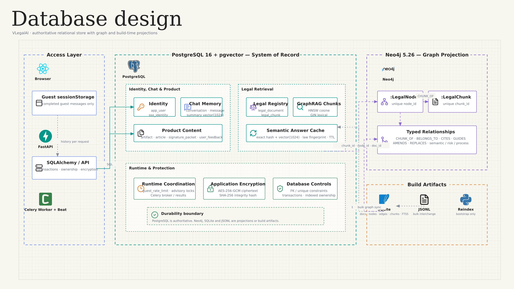
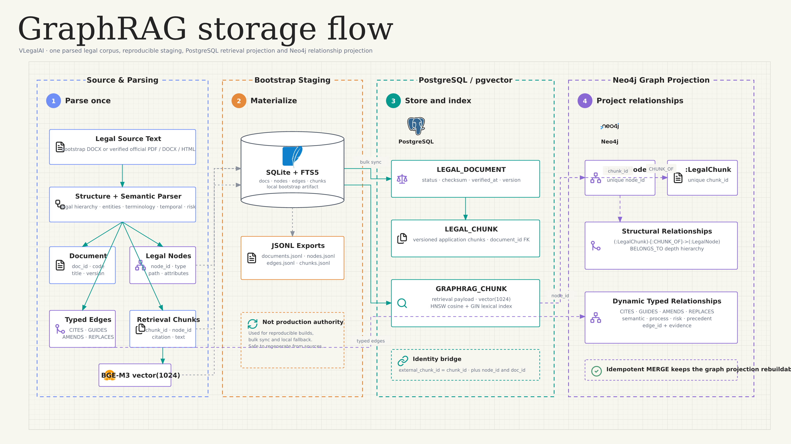

# VLegalAI Physical Database Design

## Database boundaries

| Store | Role | Authoritative data |
|---|---|---|
| PostgreSQL 16 + pgvector | Main system of record and retrieval store | Identity, chat, encrypted memory, legal registry, versioned chunks, vector/lexical projection, product data, answer cache, rate limits, advisory locks, Celery transport/results |
| Neo4j 5.26 | Graph projection | Legal nodes, legal chunks, structural and semantic relationships |
| SQLite + JSONL | Bootstrap artifact and optional local fallback | Parsed corpus, nodes, edges, chunks, FTS5, precomputed embeddings |
| Browser `sessionStorage` | Temporary guest state | Completed guest chat messages for the current tab session |
| Docker volumes | Persistence substrate | PostgreSQL, Neo4j, legal build artifacts, model checkpoints, Caddy state |

## PostgreSQL application schema

### Identity and authentication

| Table | Primary/unique keys | Main fields | Delete behavior and indexes |
|---|---|---|---|
| `app_user` | PK `id`; unique index `email` | `email`, `display_name`, `avatar_url`, `role`, `is_active`, `last_login_at`, timestamps | Role and active-state indexes |
| `sso_identity` | PK `id`; unique (`issuer`, `subject`) | FK `user_id`, `provider`, `claims` JSONB, timestamps | `user_id → app_user.id ON DELETE CASCADE`; index on `user_id` |

Identity fields and OIDC claims are not encrypted by the application.

### Conversation and long-term memory

| Table | Primary/unique keys | Main fields | Protection and indexes |
|---|---|---|---|
| `conversation` | PK `id` | FK `user_id`, `title`, `status`, `retrieval_mode`, timestamps | User/status indexes; composite `(user_id, updated_at)` |
| `chat_message` | PK `id` | FK `conversation_id`, `role`, `content_ciphertext`, `content_hash`, `sources` JSONB, `verification` JSONB, `token_count`, `status`, `created_at` | AES-GCM content; hash index; `(conversation_id, created_at)` |
| `conversation_summary` | PK `id`; unique `conversation_id` | `summary_ciphertext`, `summary_hash`, `source_message_count`, embedding model/revision, `embedding vector(1024)`, timestamps | AES-GCM summary; HNSW cosine index; message-count check |

Both chat tables cascade when their parent conversation is deleted. A conversation cascades when its user is deleted.

### Legal registry and retrieval projection

| Table | Primary/unique keys | Main fields | Indexes and synchronization |
|---|---|---|---|
| `legal_document` | PK `id`; unique nullable `external_doc_id` | `code`, `title`, `issuer`, source/official domain, status, effective dates, replacement code, checksum, version, verification time/payload | Code/status/verification indexes; GIN search on code + title |
| `legal_chunk` | PK `id`; unique `external_chunk_id`; unique (`document_id`, `version`, `ordinal`) | FK `document_id`, `node_id`, chunk type, title, citation, text, text hash, ordinal, version | Cascades with document; document/version, node, and hash indexes |
| `graphrag_chunk` | PK `chunk_id` | `doc_id`, `node_id`, chunk type, title/path/citation/text, token count, ordinal, source/law metadata, embedding model/revision, `embedding vector(1024)`, `updated_at` | HNSW cosine; GIN text-search expression; indexes on document, node, and type |

`graphrag_chunk` is created by migration and maintained with direct psycopg SQL. It does not have a SQLAlchemy ORM model and has no database foreign key to `legal_chunk`.

### Semantic answer cache and runtime coordination

| Table | Key | Main fields | Constraints/indexes |
|---|---|---|---|
| `legal_answer_cache` | PK `id`; unique `query_hash` | encrypted query/answer, answer hash, query vector, sources, verification, law fingerprint, model/prompt version, expiry, hit counters, timestamps | HNSW cosine; indexes on answer hash, fingerprint, and expiry; non-negative hits |
| `guest_rate_limit` | Composite PK (`subject_hash`, `window_kind`, `window_start`) | `request_count`, `updated_at` | Window kind is `MINUTE` or `HOUR`; positive count; expiry-cleanup index |
| Celery tables | Managed by Celery/SQLAlchemy transport | Broker queue and task results | Not created by the repository Alembic migrations |

PostgreSQL advisory locks are used for freshness updates and conversation-summary refresh. Locks are transactional and do not require an application table.

### Product content

| Table | Primary/unique keys | Main fields | Protection / delete rule |
|---|---|---|---|
| `artifact` | PK `id` | FK `user_id`, kind, title, encrypted content, metadata JSONB, status, timestamps | Content encrypted; user delete cascades |
| `article` | PK `id`; unique `slug` | nullable author FK, title, excerpt, content, category, status, source URL, web sources, views, publication time | Editorial content plaintext; author delete sets null; GIN full-text search |
| `signature_packet` | PK `id` | FK `user_id`, title, encrypted document, document hash, signers JSONB, audit log JSONB, status, timestamps | Document encrypted; user delete cascades |
| `user_feedback` | PK `id` | nullable user FK, encrypted message, page, created time | Message encrypted; user delete sets null |

## Final pgvector layout

| Table | Vector column | Dimensions | Index | Purpose |
|---|---|---:|---|---|
| `graphrag_chunk` | `embedding` | 1024 | HNSW, cosine ops, `m=16`, `ef_construction=64` | Legal dense retrieval |
| `conversation_summary` | `embedding` | 1024 | HNSW, cosine ops, `m=16`, `ef_construction=64` | Searchable long-term conversation memory |
| `legal_answer_cache` | `query_embedding` | 1024 | HNSW, cosine ops, `m=16`, `ef_construction=64` | Cross-user semantic cache lookup |

All three vectors are produced by the configured BGE-M3 revision. Migration `20260721_0003` truncates incompatible legacy 1536-dimensional vectors before adding 1024-dimensional BGE-M3 vectors.

## Neo4j projection

### Constraints and indexes

- Unique `:LegalNode(node_id)`.
- Unique `:LegalChunk(chunk_id)`.
- Indexes on legal-node type/document and legal-chunk node/type.
- Full-text index `legal_chunk_fulltext` across chunk `title`, `citation`, and `text`.

### Node labels

- `LegalNode`: document and structural/semantic legal concepts.
- `LegalChunk`: retrievable textual evidence linked to a `LegalNode`.

### Core relationships

- Structure: `CHUNK_OF`, `BELONGS_TO`.
- Cross-document law: `CITES`, `GUIDES`, `AMENDS`, `REPLACES`, `ISSUED_BY`.
- Terminology/domain: `DEFINED_AS`, `APPLIES_TO`, `HAS_PARAMETER`, `SIGNS`, `PERFORMS`, `ENTITLED_TO`, `PROHIBITED_BY`.
- Temporal/process: `STARTS_LIMITATION`, `TRANSITIONS_STATE`, `REQUIRES_CONDITION`, `INCLUDES_DOSSIER`, `SUBMITTED_AT`, `HAS_DURATION`.
- Lifecycle/risk: `NEXT_STAGE`, `TRIGGERS_OBLIGATION`, `CAUSES_RISK`, `MITIGATED_BY`.
- Precedent: `APPLIES_ARTICLE`, `SIMILAR_FACTS`, `LEADS_TO_RULING`.
- Unknown builder relation names map to `RELATED_TO`.

## SQLite bootstrap schema

The builder recreates `legal_graphrag.sqlite` with:

- `docs`
- `nodes`
- `edges`
- `chunks`
- `index_metadata`
- FTS5 virtual table `chunk_fts`

It also exports `documents.jsonl`, `nodes.jsonl`, `edges.jsonl`, and `chunks.jsonl`. The vector BLOB is not included in JSONL exports.

## Encryption and exposure matrix

| Data | Application treatment |
|---|---|
| Chat content | AES-GCM ciphertext + SHA-256 hash |
| Conversation summary | AES-GCM ciphertext + hash + searchable vector |
| Artifact content | AES-GCM ciphertext |
| Signature document | AES-GCM ciphertext + SHA-256 hash |
| Feedback message | AES-GCM ciphertext |
| Cached public query/answer | AES-GCM ciphertext + hashes; query vector remains searchable |
| User email/name/avatar | Plaintext columns |
| OIDC claims | Plaintext JSONB |
| Conversation/artifact/signature titles | Plaintext |
| Signature signers/audit log | Plaintext JSONB |
| Article and legal corpus text | Plaintext/searchable |
| Sources and verification evidence | Plaintext JSONB |

The AES-GCM key is 32 bytes. The preferred source is `MESSAGE_ENCRYPTION_KEY`; when it is absent, the code derives a key by hashing `SESSION_SECRET`.

## Referential-integrity map

| Parent | Child | Database rule |
|---|---|---|
| `app_user` | `sso_identity` | `ON DELETE CASCADE` |
| `app_user` | `conversation` | `ON DELETE CASCADE` |
| `conversation` | `chat_message` | `ON DELETE CASCADE` |
| `conversation` | `conversation_summary` | `ON DELETE CASCADE`, unique child |
| `app_user` | `artifact` | `ON DELETE CASCADE` |
| `app_user` | `signature_packet` | `ON DELETE CASCADE` |
| `app_user` | `article` | `ON DELETE SET NULL` |
| `app_user` | `user_feedback` | `ON DELETE SET NULL` |
| `legal_document` | `legal_chunk` | `ON DELETE CASCADE` |

Cross-store projection links are enforced by application upsert/MERGE operations, not by database foreign keys.

