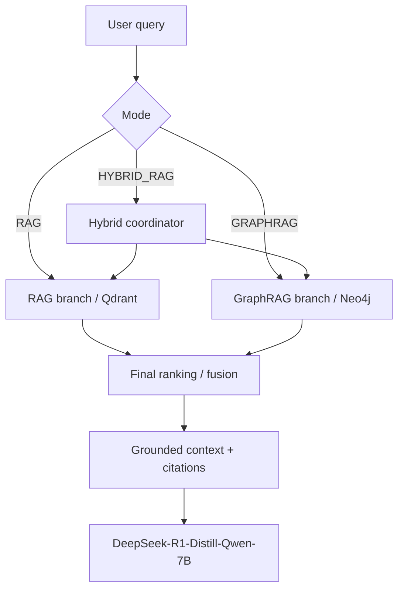

# VLegalAI Logical ERD — RAG, GraphRAG và HybridRAG đa tầng

**Phiên bản:** 2.1  
**Ngày:** 13/07/2026  
**Trạng thái:** Logical Design TO-BE + Physical Database Design TO-BE  
**Model sinh câu trả lời được xác nhận cho thiết kế:** `DeepSeek-R1-Distill-Qwen-7B` (DeepSeek 7B)

## 1. Phạm vi và nguyên tắc

Thiết kế chỉ công bố ba mode runtime:

- `RAG`: một nhánh truy xuất vector trên Qdrant.
- `GRAPHRAG`: một nhánh truy xuất graph trên Neo4j.
- `HYBRID_RAG`: chạy đúng hai nhánh RAG và GraphRAG, sau đó hợp nhất kết quả.

`HYBRID_RAG` không phải model, kho dữ liệu hoặc nhánh truy xuất thứ ba. `LOCAL`, `SQLITE_RAG` và `AUTO` không thuộc product contract. SQLite chỉ là staging/build artifact để parse, kiểm tra và đồng bộ cùng một `INDEX_VERSION` sang Qdrant và Neo4j.

> Lưu ý audit: đây là logical target. Source hiện còn `local_graphrag`/SQLite fallback và production path mặc định Groq/Llama. Các sai lệch đó được nêu trong báo cáo đánh giá; không được dùng ERD TO-BE để khẳng định runtime hiện tại đã tuân thủ.

## 2. Nguồn Mermaid

| View | Nguồn Mermaid đầy đủ | View rút gọn dùng trong DOCX |
|---|---|---|
| System overview | `mermaid/system_overview.mmd` | cùng file |
| Knowledge & Index | `mermaid/knowledge_index_erd.mmd` | `mermaid/knowledge_index_overview.mmd` |
| Runtime/Application | `mermaid/runtime_hybrid_erd.mmd` | `mermaid/runtime_retrieval_overview.mmd`, `mermaid/contract_signature_overview.mmd` |
| Evaluation/MLOps | `mermaid/evaluation_mlops_erd.mmd` | `mermaid/dataset_evaluation_overview.mmd`, `mermaid/experiment_mlops_overview.mmd` |
| Physical user/chat | `mermaid/physical_user_chat_erd.mmd` | `mermaid/physical_user_chat_overview.mmd`; PostgreSQL TO-BE |

Các file `.mmd` là Mermaid source chính thức. View rút gọn giữ nguyên entity và cardinality nhưng chỉ hiển thị khóa/thuộc tính quan trọng để đọc được trên trang in. Thuộc tính đầy đủ nằm trong ba file ERD đầy đủ và data dictionary của báo cáo DOCX.

## 3. Kiến trúc truy xuất và sinh câu trả lời

Mô hình runtime chi tiết dùng chuỗi trace:

`RETRIEVAL_RUN → RETRIEVAL_BRANCH → BRANCH_HIT → HIT_CONTRIBUTION → RETRIEVAL_HIT → ANSWER_CITATION`.

Nhờ chuỗi này, cùng một chunk xuất hiện ở cả hai nhánh Hybrid chỉ tạo một `RETRIEVAL_HIT` cuối nhưng giữ được hai đóng góp độc lập.

## 4. Ba miền dữ liệu logic

### 4.1 Knowledge & Index

- Nguồn luật: `ISSUING_AUTHORITY`, `LEGAL_DOCUMENT`, `DOCUMENT_VERSION`, `VERSION_EFFECT`.
- Graph đa tầng: `KNOWLEDGE_LAYER`, `KNOWLEDGE_NODE`, `KNOWLEDGE_RELATION`, `RELATION_EVIDENCE`.
- RAG/index: `TEXT_CHUNK`, `MODEL_VERSION`, `CHUNK_EMBEDDING`, `INDEX_VERSION`, `INDEX_DOCUMENT`, `INDEX_MATERIALIZATION`.

`DOCUMENT_VERSION` tách hiệu lực pháp lý khỏi bản ghi văn bản gốc. `INDEX_VERSION` pin source manifest, builder và config để Qdrant/Neo4j luôn là hai materialization của cùng một snapshot.

### 4.2 Runtime & Application

- Hội thoại: `APP_USER`, `RAG_SESSION`, `CHAT_MESSAGE`, `USER_FEEDBACK`.
- Retrieval/fusion: `RETRIEVAL_RUN`, `RETRIEVAL_BRANCH`, `BRANCH_HIT`, `FUSION_RUN`, `RETRIEVAL_HIT`, `HIT_CONTRIBUTION`.
- Generation/citation: `MODEL_VERSION`, `PROMPT_VERSION`, `GENERATION_RUN`, `ANSWER_CITATION`.
- Hợp đồng: `CONTRACT`, `CONTRACT_VERSION`, `CONTRACT_REVIEW`, `REVIEW_FINDING`, `CONTRACT_EVIDENCE`.
- Ký và audit: `SIGNATURE_PACKET`, `PACKET_SIGNER`, `SIGNATURE_EVENT`.

### 4.3 Evaluation & MLOps

- Dataset: `DATASET_VERSION`, `DATA_SPLIT`, `EVAL_CASE`, `GROUND_TRUTH_EVIDENCE`, `ANNOTATION_REVIEW`.
- Experiment: `EXPERIMENT`, `EXPERIMENT_RUN`, `RUN_MODEL_BINDING`, `PROMPT_VERSION`, `MODEL_VERSION`.
- Kết quả: `CASE_RESULT`, `CASE_RETRIEVAL`, `METRIC_DEFINITION`, `METRIC_OBSERVATION`, `ERROR_CASE`, `RUN_COMPARISON`, `RUN_ARTIFACT`.

## 5. Mapping GraphRAG tám tầng

| Ordinal | Mã gợi ý | Ý nghĩa | Ví dụ node/relation |
|---:|---|---|---|
| 1 | `STRUCTURE` | Cấu trúc và liên kết văn bản | Văn bản, chương, mục, điều, khoản, điểm; `THUỘC_VỀ`, `THAM_CHIẾU` |
| 2 | `TERMINOLOGY` | Thuật ngữ, định nghĩa, công thức | Thuật ngữ pháp lý; `ĐƯỢC_ĐỊNH_NGHĨA_TẠI` |
| 3 | `DOMAIN` | Chủ thể, quyền, nghĩa vụ, điều kiện | Người lao động, người sử dụng lao động; `CÓ_QUYỀN`, `CÓ_NGHĨA_VỤ` |
| 4 | `TEMPORAL_STATE` | Hiệu lực, thời hạn, trạng thái | `CÓ_HIỆU_LỰC_TỪ`, `HẾT_HIỆU_LỰC`, `CHUYỂN_TRẠNG_THÁI` |
| 5 | `PROCEDURE` | Thủ tục, hồ sơ, cơ quan, deadline | Bước thủ tục; `YÊU_CẦU_HỒ_SƠ`, `THỰC_HIỆN_BỞI` |
| 6 | `LIFECYCLE` | Chuỗi vòng đời nghiệp vụ | Giao kết → thực hiện → sửa đổi → chấm dứt |
| 7 | `COMPLIANCE_RISK` | Cấm, chế tài, rủi ro | `BỊ_CẤM`, `CÓ_CHẾ_TÀI`, `RỦI_RO` |
| 8 | `PRECEDENT` | Án lệ, quyết định, tình huống tương tự | `ÁP_DỤNG_TRONG`, `TƯƠNG_TỰ`, `GIẢI_THÍCH` |

Mọi `KNOWLEDGE_NODE` phải thuộc đúng một `KNOWLEDGE_LAYER`; relation có source/target rõ và evidence trỏ về chunk.

## 6. Invariant của RAG/GraphRAG/HybridRAG

| Mode | Branch bắt buộc | Backend | Fusion |
|---|---|---|---|
| `RAG` | đúng 1 branch `RAG` | Qdrant | không có |
| `GRAPHRAG` | đúng 1 branch `GRAPHRAG` | Neo4j | không có |
| `HYBRID_RAG` | đúng 2 branch: một `RAG`, một `GRAPHRAG` | Qdrant + Neo4j | đúng 1 `FUSION_RUN` |

- `UNIQUE(retrieval_run_id, branch_type)`.
- Hybrid không được có nhánh thứ ba và không âm thầm fallback sang Local.
- Hai nhánh Hybrid phải dùng cùng `index_version_id`.
- `FUSION_RUN` chỉ tồn tại cho `HYBRID_RAG`; `rag_weight + graphrag_weight = 1` khi dùng weighted fusion.
- `UNIQUE(retrieval_run_id, chunk_id)` và `UNIQUE(retrieval_run_id, final_rank)`.
- Citation chỉ trỏ tới final hit, không trỏ trực tiếp raw branch hit.

## 7. Invariant DeepSeek 7B

`GENERATION_RUN.model_version_id` phải pin một `MODEL_VERSION` có:

- `model_family = DeepSeek`;
- `model_name = DeepSeek-R1-Distill-Qwen-7B`;
- `parameter_scale = 7B`;
- `model_role = GENERATOR`;
- `model_status = ACTIVE`;
- `revision` và `model_checksum` không rỗng.

Tên hiển thị “DeepSeek 7B” không đủ cho reproducibility nếu thiếu revision/checksum và run manifest.

## 8. Ràng buộc dữ liệu chính

- `UNIQUE(document_id, version_no)`; `effective_to >= effective_from` khi có cả hai.
- `VERSION_EFFECT.source_version_id != target_version_id`; effect type thuộc `AMENDS`, `REPLACES`, `GUIDES`, `CITES`, `ANNULS`.
- `KNOWLEDGE_LAYER.ordinal` duy nhất và nằm trong 1–8.
- Node, relation, chunk, embedding cùng một `index_version_id`.
- `UNIQUE(index_version_id, canonical_key)` cho node.
- `UNIQUE(index_version_id, chunk_id, model_version_id)` cho embedding.
- `INDEX_VERSION` bất biến sau khi `ACTIVE`; materialization phải khớp manifest/checksum.
- `UNIQUE(contract_id, version_no)`; contract version đã đưa vào gói ký là bất biến.
- `SIGNATURE_EVENT` append-only và nối chuỗi hash.
- Dataset `FROZEN` là bất biến; train/validation/test không trùng case theo split policy.
- `UNIQUE(run_id, eval_case_id)` và `UNIQUE(run_id, model_role)`.
- Baseline/candidate comparison phải dùng cùng dataset version, split và metric definition.

## 9. Khóa liên kết xuyên kho

| Khóa | Vai trò |
|---|---|
| `document_version_id` | Định danh đúng phiên bản pháp lý được index và trích dẫn |
| `index_version_id` | Pin cùng snapshot giữa metadata, Neo4j và Qdrant |
| `node_id` | Liên kết graph node với chunk/evidence |
| `chunk_id` | Liên kết Qdrant point, Neo4j chunk, retrieval hit và ground truth |
| `model_version_id` | Pin generator/evaluator/embedding model |
| `retrieval_run_id` | Trace query → branch → fusion → generation |
| `run_id` | Trace dataset/config/model/prompt → metrics/artifacts |

## 10. Ánh xạ vật lý AS-IS

| Logical object | Materialization hiện có | Khoảng trống |
|---|---|---|
| `LEGAL_DOCUMENT` | SQLite `docs`, `documents.jsonl` | Gộp document/version; thiếu effectivity/version history |
| `KNOWLEDGE_NODE` | SQLite `nodes`, Neo4j `:LegalNode`, `nodes.jsonl` | Tám tầng multiplex bằng `node_type`; chưa pin index version |
| `KNOWLEDGE_RELATION` | SQLite `edges`, Neo4j relationship động, `edges.jsonl` | Thiếu relation type registry và provenance/version đầy đủ |
| `TEXT_CHUNK` | SQLite `chunks`, Neo4j `:LegalChunk`, Qdrant payload, `chunks.jsonl` | Chưa có content checksum/version contract xuyên kho |
| `CHUNK_EMBEDDING` | `chunks.vector`, Qdrant named vector | Vector hiện là feature hash; thiếu model provenance độc lập |
| `INDEX_VERSION` | chưa có bảng | Chỉ suy ra từ config/folder/thời điểm build |
| Chat/retrieval/generation/citation | không có durable store | Không thể trace/fusion/citation audit end-to-end |
| Contract/review/signature | không có durable store | Chủ yếu transient; signature package không persist |
| Feedback | JSONL | Chưa liên kết user/session/message |
| Evaluation/MLOps | JSON/JSONL/CSV | Chưa có registry/manifest đầy đủ, MLflow/W&B hoặc relational schema |

## 11. Physical target đề xuất

- PostgreSQL: metadata, document/version, runtime, contract/signature, evaluation và constraints/migration.
- Neo4j: `KNOWLEDGE_NODE`, `KNOWLEDGE_RELATION`, chunk-to-node projection của GraphRAG.
- Qdrant: `CHUNK_EMBEDDING` và payload theo `chunk_id`/`index_version_id` cho RAG.
- Object storage: source files, model artifacts, prompt/dataset manifests và run artifacts.
- SQLite: chỉ staging/build artifact hoặc development tool; không phải mode runtime công bố.

## 12. Physical Database Design — user và hội thoại

Đặc tả vật lý chi tiết nằm tại `docs/design/VLegalAI_Physical_Database_Design.md`; migration PostgreSQL đề xuất nằm tại `docs/design/sql/V001__runtime_user_privacy.sql`.

| Logical entity | Physical table | Trường vật lý trọng yếu | Type/size | Default/key |
|---|---|---|---|---|
| `APP_USER` | `app_user` | user_id; email_hash; display_name_hash; password_hash; profile_hash; conversation_hash | UUID; CHAR(64); VARCHAR(255) | UUID generated; email hash unique; status ACTIVE; hash key version 1 |
| `RAG_SESSION` | `rag_session` | session_id; user_id; title_hash; conversation_hash; status/timestamps | UUID; CHAR(64); VARCHAR(16); TIMESTAMPTZ | FK user; status ACTIVE; timestamps current |
| `CHAT_MESSAGE` | `chat_message` | message_id; session_id; role; message_content_hash; token_count | UUID; VARCHAR(16); CHAR(64); INTEGER | FK session; status COMPLETED; token_count 0 |
| `RETRIEVAL_RUN` | `retrieval_run` | request_message_id; index_version_id; mode; normalized_query_hash; top-k | UUID; VARCHAR(16); CHAR(64); SMALLINT | mode check; top-k 10; status PENDING |
| `USER_FEEDBACK` | `user_feedback` | user/session/message FK; rating; comment_hash; page_hash | UUID; SMALLINT; CHAR(64) | rating 1–5; created_at current |

`APP_USER` bắt buộc có user identity ở dạng hash: `email_hash`, `display_name_hash`, `password_hash`, `profile_hash`; có thể có `phone_hash`, `organization_hash` và một trường `conversation_hash`. Không có cột email, tên, điện thoại, password hoặc conversation content dạng rõ.

- Password: Argon2id có salt riêng, encoded trong `VARCHAR(255)`.
- Email/tên/điện thoại/profile/query/message/feedback: HMAC-SHA-256 có khóa, hex `CHAR(64)`.
- Khóa HMAC không lưu trong database; chỉ lưu `hash_key_version`.
- `conversation_hash` là rolling digest để kiểm tra tính toàn vẹn, không thể dùng để đọc lại hội thoại.
- Nội dung hội thoại rõ chỉ tồn tại tạm thời trong runtime; log/APM/backup không được ghi nội dung rõ.

## 13. Điều kiện xác nhận đã materialize

Physical design chỉ được đánh dấu “đã materialize vào system” khi migration chạy trên PostgreSQL và bằng chứng introspection khớp table/field/type/size/default/PK/FK/unique/check/index; đồng thời test âm tính chứng minh không có raw PII, raw query hoặc raw conversation trong database/log/backup.

Trạng thái hiện tại: **thiết kế TO-BE đã có DDL và logical mapping; runtime materialization vẫn pending**. SQLite/Neo4j/Qdrant AS-IS chỉ materialize một phần Knowledge & Index, không materialize user/chat domain.
